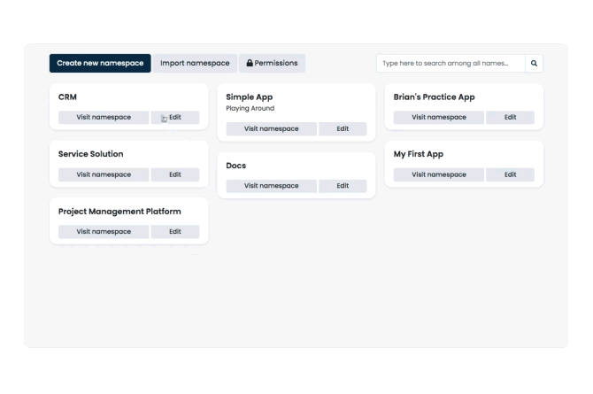

<h1 align="center">
  
   
   
  <abbr>Freedom. Flexibility. Performance. Speed.</abbr>
   
   
  

  
  
  

  
  

  

  

</h1>

The Corteza low-code platform lets you build and iterate CRM, business process and other structured data apps fast, create intelligent business process workflows and connect with almost any data source.
All with the flexibility, freedom and control you get from a 100% open-source platform written on modern technologies maintained by [Planet Crust](https://www.planetcrust.com/), its founder.

  

## Key Features

* **Standards oriented** by using well established data formats, technologies, and design decisions.
* **Flexible security** provided as a flattened RBAC facility allows organizations to apply complex internal security policies to Corteza.
* **Extensive privacy features** provide a way for organizations to configure Corteza to conform to data privacy regulations in the regions they are operating in.
* **Accessible** conforming to the WCAG 2.1 guidelines allowing simple use for a wider audience.
* **Integratable** into and with external services and other Corteza instances due to it's API-centric design, flexible data storage layer, and powerful automation facilities.
* **Customizable** from translations and terminology to prebuilt low-code applications to completely new low-code applications and business processes.

## Getting Started

 

> **Note**
> Planet Crust offers hosted [Corteza cloud instances](https://www.planetcrust.com/start-trial-lp-main) as the easiest way to get started.

 

Refer to the [DevOps guide](https://docs.cortezaproject.org/corteza-docs/2022.9/devops-guide/index.html) for a complete guide on how to get Corteza up and running.
Additionally, we've provided some [video instructions](https://forum.cortezaproject.org/t/videos-on-how-to-set-up-corteza/91).

Quick references:
* [data backup and restore](https://docs.cortezaproject.org/corteza-docs/2022.9/devops-guide/maintenance/backups.html)
* [troubleshooting](https://docs.cortezaproject.org/corteza-docs/2022.9/devops-guide/troubleshooting/index.html)
* [setting up an email relay](https://docs.cortezaproject.org/corteza-docs/2022.9/devops-guide/email-relay.html)
* [setting up sink routes](https://docs.cortezaproject.org/corteza-docs/2022.9/devops-guide/sink-route.html)
* [offline](https://docs.cortezaproject.org/corteza-docs/2022.9/devops-guide/examples/deploy-offline/index.html) and [online](https://docs.cortezaproject.org/corteza-docs/2022.9/devops-guide/examples/deploy-online/index.html) configuration examples
* [online demo instance](https://latest.cortezaproject.org/) for a hands-on feature exploration

## Creating With Corteza

Refer to the [Integrator Guide](https://docs.cortezaproject.org/corteza-docs/2022.9/integrator-guide/index.html) to learn how you can build on the core features to create virtually anything.

Quick references:
* [Corteza Compose configuration](https://docs.cortezaproject.org/corteza-docs/2022.9/integrator-guide/compose-configuration/index.html)
* automation using [workflows](https://docs.cortezaproject.org/corteza-docs/2022.9/integrator-guide/automation/workflows/index.html) and [automation scripts](https://docs.cortezaproject.org/corteza-docs/2022.9/integrator-guide/automation/automation-scripts/index.html)
* [using the REST API](https://docs.cortezaproject.org/corteza-docs/2022.9/integrator-guide/accessing-corteza/index.html),

## Upgrading Corteza

Refer to the [changelog](https://docs.cortezaproject.org/corteza-docs/2022.9/changelog/index.html) and the [upgrade guide](https://docs.cortezaproject.org/corteza-docs/2022.9/devops-guide/upgrade/index.html) to upgrade your Corteza instance.

## Contributing

Refer to the [Developer Guide/Corteza Server](https://docs.cortezaproject.org/corteza-docs/2022.9/developer-guide/corteza-server/index.html) document for details regarding the [development setup](https://docs.cortezaproject.org/corteza-docs/2022.9/developer-guide/corteza-server/index.html#_development_setup), the [project structure](https://docs.cortezaproject.org/corteza-docs/2022.9/developer-guide/corteza-server/structure.html), and the feature insight documents.

Refer to the [CONTRIBUTING.md](CONTRIBUTING.md) for contribution guidelines and code of conduct.

## Community

Reach out to us on [our forum](https://forum.cortezaproject.org/).

## License

Corteza is released under the Apache-2.0 license.
Refer to the [LICENSE](LICENSE) file for additional information.
